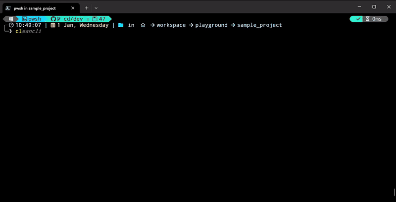

# Flutter Clean Architecture CLI

**cleancli** is a command-line tool designed to simplify the creation of boilerplate code for projects following the Clean Architecture pattern. This tool, built in Go, is fast, safe, and user-friendly.

## Demo Video



## Example Usage
- Add the executable to the path 
 
```
$ cleancli
```
- When prompted, input details such as:
   - API URL: `v1/login/{type}`
   - Request Model (Picker with search): `LoginRequest` or `None`
   - Response Model (Picker with search): `LoginResponse`
   - Function Name: `userLogin`
   - File/Group Name: `user_authentication`

- The CLI will generate or update files in the appropriate directories, adhering to the Clean Architecture structure.

## Directory Structure

Here’s an example of the directory structure that is needed to us this tool

```
proj/
├── lib/
│
├── data/
│   ├── di
│   ├── network/
│   ├── entity/
│   ├── source/
│   └── repository/
└── domain/
    ├── di
    ├── usecase/
    └── repository/
```

---

## Features

- **Automation**: 
  - Automatically generates:
    - Data source files (e.g., network, local source) along with implementations and providers.
    - Repository files with their implementations and providers.
    - Use cases and their respective providers.
  - Accepts minimal inputs such as:
    - API URL
    - Request model
    - Response model
    - Function name
    - File name
  - **Smart Updates**: If the file already exists, the tool intelligently updates it without overwriting the existing logic.

---


## How to Clone and Run the CLI

### Prerequisites
- Ensure that Go is installed on your machine. [Download Go](https://golang.org/dl/)
- Install Dart and Flutter on your machine. [Flutter Install Guide](https://flutter.dev/docs/get-started/install)

### Steps
1. Clone the repository:
   ```bash
   git clone https://github.com/vineeshvk/cleancli.git
   cd cleancli
   ```

2. Build the CLI:
   ```bash
   go build -o cleancli
   ```

3. Run the CLI:
   ```bash
   ./cleancli
   ```

---

